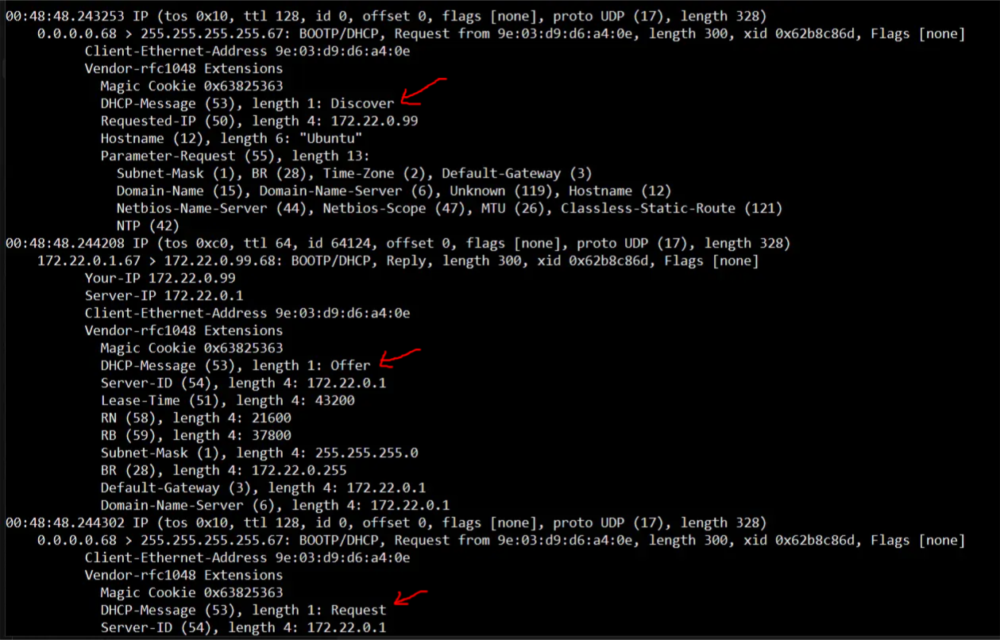
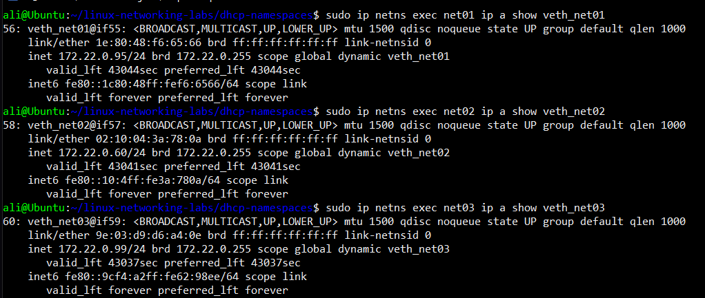

# linux-networking-labs/dhcp-namespaces  

This is a lab for DHCP protocol practice. Main goal - create
network L2 isolation on the host, configure DHCP and assign 
IP addresses, like simulation of cloud-based virtual machines

Here is the topology (generated by AI btw)
```
[ Subnet: 172.22.0.0/24 ]
+-----------------+        +-----------------+        +-----------------+
|   Cloud VM 1    |        |   Cloud VM 2    |        |   Cloud VM 3    |
|  (Namespace 1)  |        |  (Namespace 2)  |        |  (Namespace 3)  |
+-----------------+        +-----------------+        +-----------------+
       |                           |                           |
   (veth-ns01)                 (veth-ns02)                 (veth-ns03)
       |                           |                           |
       |                           |                           |
       +---------------------------+---------------------------+
                                   |
                                   |
                   +-----------------------------+
                   |    Virtual Bridge (br0)     |
                   |       (DHCP Gateway)        |
                   +-----------------------------+
                                   |
                                   |
                           +---------------+
                           |  DHCP Server  |
                           |   (dnsmasq)   |
                           +---------------+
```


I have done this project with isc-dhcp plugin and also dnsmasq. 
I'll show you only second variation bc i think isc-dhcp is almost deprecated

I divided the process into three phases
1. Phase 1 - Preparations
2. Phase 2 - DHCP configuring
3. Phase 3 - Assignment

Configure the conf.env file to your needs
 
By the way, you have cleanup.sh script so you can run script without 
any doubts. Everything will be ceared automatically 

You can see all the photos below and in the ".images/" directory.


