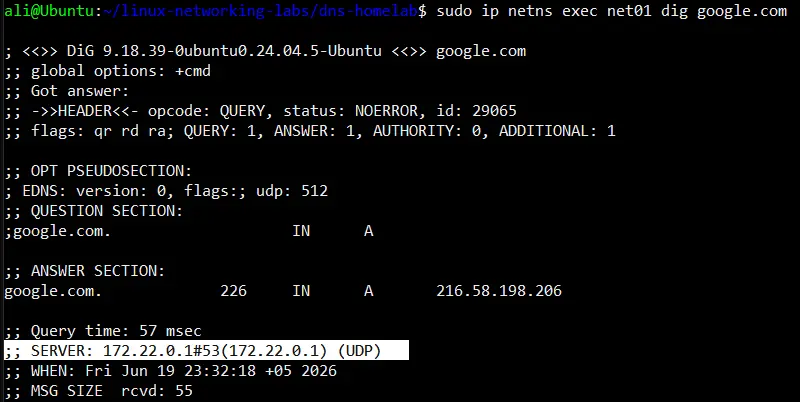

# linux-networking-labs/dns-homelab

This is a lab for DNS practice. Main goal - create network L2 isolation, configure the host
machine as DNS and enable namespaces to utilize the host as **DNS Recursive Resolver**

I have done this project using dnsmasq. Also i used the environment preparation script and cleanup
script from the previous project 

#### I divided the process into three phases
1. Phase 1 - dnsmasq configuration
2. Phase 2 - resolv.conf imitation for each namespace
3. Phase 3 - iptables configuraton 

#### What happens at performing DNS query:
1. We create an isolated file at /etc/netns/NS/resolv.conf with line `nameserver $BRIDGE_IP_WTM`. Any process inside this network namespace is bound to this entry
2. An app inside the namespace sends a DNS query direcrly to the bridge IP address of the host
3. The dnsmasq service intercepts this packet because our conf includes directive listen-address=127.0.0.1,$BRIDGE_IP_WTM
4. Our config includes the no-resolv flag. This instructs dnsmasq to completely ignore the main /etc/resolv.conf
5. Instead of uskng host files, dnsmasq reads the server=8.8.4.4 directive and routes the query to the external upstream DNS network via our host interface using NAT, Masquerade

Configure the conf.env file to your needs

You can see all the photos below and in the ".images/" directory.

