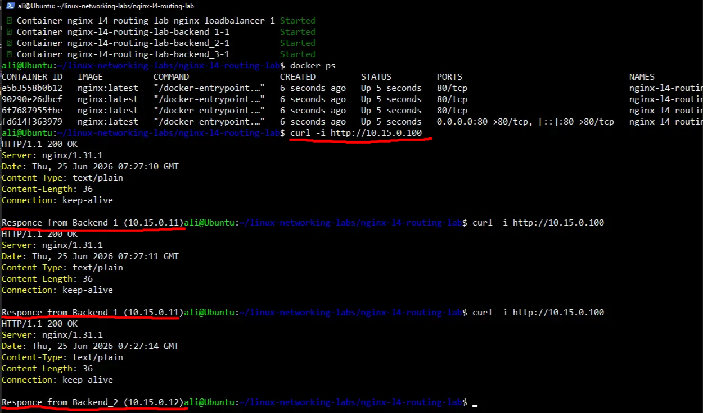

## Simple L4 Nginx Load Balancing practice

There are 3 isplated containers in Docker compose in subnet 10.15.0.0/24. Each one has
its own specifications and load balancer takes them into account.
I've used classic "Round robin" method for the L4 Load balancer.

Run it by simply writing:
```docker compose up -d```

You can see all the photos below and also in the ".images/" directory.

